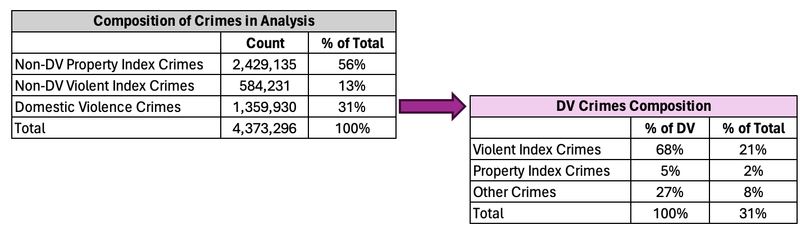

# Domestic Violence in Chicago - A Comparison to Violent and Property Crime Trends

## Introduction & Motivation
In this project, I seek to understand whether domestic violence in Chicago over the past 20 years has more closely mirrored trends in violent crime or trends in property crime, and whether this changed at all during the Covid-19 pandemic. 

This pet project continues my investigation of domestic violence in Chicago that began in a [school project](https://github.com/carolinedavidson/Domestic_Violence_Chicago) where a classmate and I investigated covariates of Domestic Violence at the Community Area level.

This project consists of two scripts:
- __1.DV_data_prep.py:__ This Python script pulls and prepares data from the Chicago Data Portal for analysis, aggregating crimes by type, month and year to the Community Area and Police District levels.
- __2. DV trends regression.qmd:__ This R Quarto file uses the csv files generated by the previous data prep script to visualize crime trends over time and perform panel regressions. Note that this file is easier to view online in its knit PDF version, __2.-DV-trends-regression.pdf__.

## Data Preparation
Data come from the Chicago Police Department (CPD) database of Reported Crimes from 2001 through the present, available [here](https://data.cityofchicago.org/Public-Safety/Crimes-2001-to-Present/ijzp-q8t2/about_data) via the Chicago Data Portal. Data are available at the individual reported crime level and anonymized to the block level. Each reported crime is classified as either domestic-related or not, as defined by the Illinois Domestic Violence Act. The Python script "1.DV_data_prep.py" fetches this data and processes it, creating csv files ready for analysis. I aggregate data to both the community area and police district level by month.

I categorize reported crimes into three __mutually exclusive__ categories for my analysis, relying on the FBI's classifications of violent and property index crimes:

- __Domestic violence crimes:__ Any reported crime classified as domestic in nature (note that this is not limited to intimate partner violence nor to physical violence). I use all domestic crimes rather than limiting this measure to violent or other more serious offenses for three reasons: (1) domestic crimes classified as crimes against property may have involved physical violence that is not reported; (2) domestic violence often starts with crimes against property before escalating to physical violence; and (3) to maintain alignment with the legal definition of domestic violence in the state of Illinois.
- __Property crimes:__ index crimes that fit the FBI's classification for property crime (burglary, larceny-theft, motor vehicle theft, arson) and were not domestic in nature
- __Violent crimes:__ index crimes that fit the FBI's classification for violent crime (murder, non-negligent manslaughter, rape, robbery, aggravated assault) and were not domestic in nature

Reported crimes that do not fit into one the three categories above are not included in my analysis. From 2001 to 2023, 7,975,641 crimes were reported to the Chicago Police department in total. Of those, 55% (4,373,296 crimes) fall into one of the three categories above and are included in my analysis. The breakdown of crimes in my analysis by type is:

It is important to keep in mind, with all three crime types but especially with domestic violence, that these are measures of *reported* crimes, not actual crime. Actual crime numbers are likely higher, and the rate of under-reporting is likely highest for domestic violence crimes, which has historically been vastly under-reported.

I aggregate the crime data to two levels: community area, and police district. While community area is perhaps the most commonly used geographical aggregation when examining Chicago, police district may be equally if not more relevant for this question if police districts differ from each other in ways that impact the level of crime in their jurisdictions or the level of reporting for any or all of the three categories used in my analysis. For most observations in the data, community area and police district are already recorded. For observations where this information is missing, I use the latitude and longitude coordinates that *are* recorded to retrieve the community area and police district number. 

## Data Visualization
The graph below shows monthly counts for the three types of crime from January 2001 through December 2023 for the city of Chicago. It is clear that all three categories of crime follow an annual cyclical pattern and that there is a general, albeit subtle in some cases, downward trend over time. The onset of the Covid-19 pandemic and the first social distancing measures in Illinois were followed by a marked change in the level of property crime, and much subtler changes for domestic violence and violent crime.

While property crime levels tend to be the highest and appear to have the most extreme cycles, when looking at monthly percent changes, violent crime appears to be the most variable over the course of a typical year:

## Regression Results
I run two panel regressions, one at the community area level and the other at the police district level, of domestic violence regressed on the following:

- property_crime: monthly count of reported property crimes in that area 
- violent_crime: monthly count of reported violent crimes in that area 
- property_crime_covid: an interaction term between property_crime and a dummy variable equal to 1 for months starting in March 2020 (to capture any change in the relationship between DV and property crime after the onset of the Covid-19 pandemic)
- violent_crime_covid: an interaction term between violent_crime and a dummy variable equal to 1 for months starting in March 2020 (to capture any change in the relationship between DV and violent crime after the onset of the Covid-19 pandemic)

I include fixed effects for: 
- month: to account for the (average) annual cycle in crime levels
- year: to account for long-term trends / yearly shocks that affect domestic violence in all areas equally
- area (community area or police district): to account for area-specific factors that might influence the level of domestic violence

Including these fixed effects allows us to make within-area comparisons, i.e. to compare community areas to themselves over time, reducing issues of bias that could creep in when making cross-area comparisons. Specifically, these fixed effects eliminate bias from: area-specific characteristics that do not vary over time; year-specific shocks that affect all areas equally; average seasonal patterns.

Coefficients and standard errors from these two regressions are shown in the table below: 

The results from both regressions show that domestic violence trends more closely mirror those of violent crime than those of property crime. The scale of the statistical association between reported domestic violence and reported violent crimes decreased during the Covid period but remained positive. This result is statistically significant at the 1% level. 

At the community area level, there is also a statistically significant association between reported property crime and reported domestic violence, but to a lesser degree than with violent crime as seen by the smaller coefficient on property_crime (for the average pre-Covid period relationship, holding all else constant) as well as a smaller sum of the main effect and interaction effect (property_crime + property_crime_covid) for the average relationship in the Covid period holding all else constant. 

At the police district level, the relationship between reported property crime and reported domestic violence is smaller and not statistically significant. Note that Chicago has 77 community areas resulting in 21,252 observations (77 areas x 23 years x 12 months) for the first regression. Meanwhile, the city has only 22 police districts resulting in 6072 observations for the second regression. With fewer observations, we can expect a decrease in precision of our estimates, which we see in the larger standard errors for the violent_crime, property_crime_covid, and violent_crime_covid coefficients, as compared to the first regression. However, the standard error for property_crime is actually smaller in the police district level regression than in the community area level regression, so the lack of statistical significance for this coefficient is not due to a decrease in precision. Rather, the point estimate is so much smaller in magnitude, that even with a reduced standard error it is statistically indistinguishable from zero. 

The plots below display the regression coefficient estimates and their 95% confidence intervals, allowing for a more visual interpretation of the information presented in the table above. 

| Community Area Level Regression Coefficients  | Police District Level Regression Coefficients |
| ------------- | ------------- |
|   |   |

## Limitations

My analysis has a few limitations, each of which provides interesting directions for further robustness checks and future work.

__Imputed community area and police districts:__ For observations where community area and police district number were not recorded in the Chicago Police Department's database, I rely on the latitude and longitude coordinates that are provided. I perform spatial joins of the crime data with shapefiles containing the boundaries of community areas and police districts in order to retrieve these variables. As such, it is important to note that in order to preserve privacy, exact addresses (or coordinates) are not reported for each reported crime. Instead, reports are anonymized to the block level with addresses provided in the following format: 63xx S WOODLAWN AVE to represent a crime reported on S Woodlawn Avenue between 63rd and 64th streets. Latitude and longitude coordinates correspond to the middle of the street on that block. Anonymizing to the block level in this manner does not locate crimes on a specific city block, but on 1 of (typically) 2 opposing block faces, making it impossible to know which side of the street the crime occurred on. Community area and police district boundaries tend to split down the center of streets. This means that crimes on block faces along these boundaries could be incorrectly assigned to the neighboring community area or police district when using either the address or longitude and latitude fields to impute the community area or police district. My analysis did not examine how the results would have changed if these border observations with incomplete data had been classified to their other potential community area or police district match.

__Crime Categorization:__ I used a very broad classification for domestic violence, relying on the Chicago Police Department's assessment of whether a reported crime could be classified as domestic according to the Illinois Domestic Violence Act. I used a rather specific classification for violent and property crimes, considering only index crimes and relying on the FBI's classifications. This may exclude violent and property crimes that are substantively meaningful for this analysis. While relying on these FBI classifications may facilitate comparison of the results of this analysis with results from other researchers who rely on the same FBI classifications, it may produce less meaningful results for Chicago by ignoring crime classification practices specific to Illinois or Chicago. 

__Scale:__ The 3 categories of reported crime are of fairly different scales, with non-DV property crime seeing the highest numbers, followed by domestic violence, then non-DV violent crime. Each of these could be standardized or indexed and the panel regressions repeated to see if the results change. Doing the analysis with the percent change of each variable rather than the count would also be an interesting approach, but is complicated by the large number of months that community areas reported zero non-DV violent index crimes.

